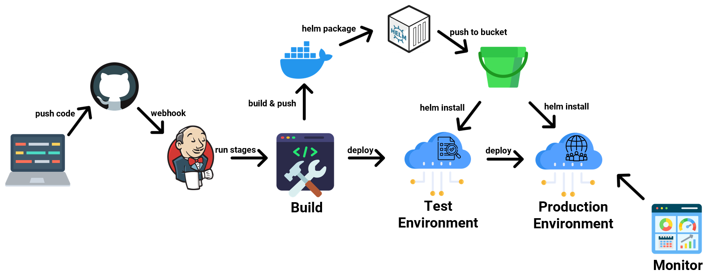

# K8s Pipeline

## Description

The project is a CI/CD pipeline that automates the application deployment process. It integrates Jenkins, Terraform, Git, and Kubernetes to enable automatic updates to the application when new commits are made to the GitHub repository. This ensures a streamlined development workflow and minimizes the chances of errors during deployment.

## How Does It Work

The project follows a three-stage process to automate the deployment workflow:
1.	Infrastructure Provisioning with Terraform:
•	Terraform is used to create and manage two Kubernetes clusters on Google Cloud: one for staging and one for production.
2.	Continuous Integration (CI) with Jenkins:
•	Upon detecting a new commit, Jenkins triggers the CI/CD pipeline.
•	The pipeline starts by cloning the project from GitHub into the Jenkins workspace.
3.	Continuous Deployment (CD) with Terraform and Kubernetes:
•	Docker is employed for containerization of the application, creating portable and consistent images.
•	The pipeline builds Docker images and pushes them to Docker Hub for easy access.
•	Terraform applies the changes to the staging Kubernetes cluster first, allowing for testing and validation.
4.	Testing and Deployment:
•	Automated tests are run on the testing environment to verify the application's functionality and stability.
•	If the tests pass successfully, the pipeline proceeds to apply the changes to the production Kubernetes cluster.
•	The application is now successfully deployed to the production environment.
## Running the Project

To run this project, follow these steps:
1.	Provision the Kubernetes Clusters with Terraform:
•	Navigate to the Terraform/ directory and create the Kubernetes clusters for testing and production environments on Google Cloud.
2.	Configure Jenkins:
•	Install the required Jenkins plugins for Kubernetes, Docker, and GitHub integration.
•	Configure Jenkins to have access to your Docker Hub account to push Docker images.
•	Set up Jenkins credentials for your Google Cloud Platform service account to manage Kubernetes clusters.
3.	Customize the Kubernetes Manifests:
•	Customize the Kubernetes manifests located in the Helm-chart/ directory according to your application's requirements.
4.	Update Jenkinsfile:
•	Adjust the Jenkinsfile to match your repository name and branch configuration.
5.	Commit and push changes to the GitHub repository.
6.	Jenkins will automatically trigger the CI/CD pipeline when it detects a new commit.
7.	Monitor the Jenkins console output for any errors during the pipeline execution.
8.	Visit the application on the production URL to verify the successful deployment.
Please note that provisioning the Kubernetes clusters with Terraform may take some time, so ensure that the clusters are up and running before starting the CI/CD pipeline to avoid any issues.

###

